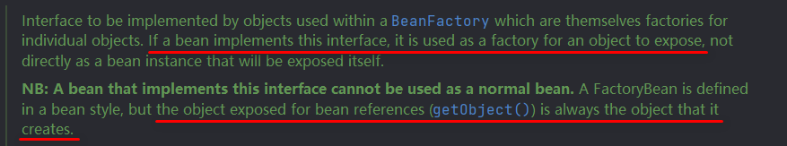
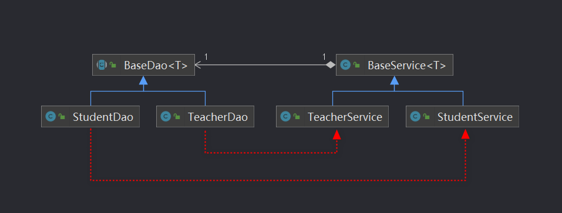
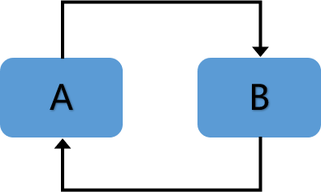
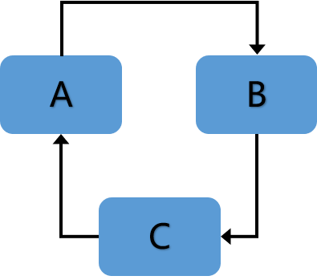

# Spring IOC容器原理入门

- [IOC官方文档](https://docs.spring.io/spring-framework/docs/current/reference/html/core.html#beans-introduction)

## IOC的基本使用

- 以前是自己new 对象，现在所有的对象交给容器创建；给容器中注册组件

- **容器**：管理所有的组件。某个组件要使用Spring提供的更多的功能（IOC、AOP），必须要加入到容器中

- **IOC（Inversion Of Control）**：控制反转，是Spring里面的一个核心概念，就是对组件对象控制权的转移，从程序代码本身转移到了外部容器，由容器来创建对象并管理对象之间的依赖关系。简单来说就是，将**对象的创建与对象的调用**交给Spring容器统一管理

- **DI（Dependency Injection）**：依赖注入，DI是对IOC更准确的描述，组件之间的依赖关系由容器在运行期决定。通俗的解释，容器能知道组件（类）A在运行的时候，需要另外一个组件（类）B。通过反射的形式，**将容器中准备好的B对象注入（利用反射给属性赋值）到A对象中**

- **目的**：降低程序之间的耦合度

- **原理**：反射机制与工厂模式

------

### IOC简单示例

- 不使用IOC，需要手动创建资源

```java
    public void test01() {
        Car car = new Car(300000.0, "Blue");
        Person person = new Person("张三", 20, car);
        System.out.println(person);
    }
```

- 使用IOC，从容器中调用资源

```java
    public void test02() {
        ApplicationContext ioc = new ClassPathXmlApplicationContext("ioc.xml");
        Object person = ioc.getBean("myPerson");
        System.out.println(person);
    }
```

```xml
<!-- ioc.xml 基于xml配置文件方式实现组件管理 -->
<bean id="myPerson" class="com.knight.ioc.bean.Person" scope="singleton">
      <property name="name" value="李四"></property>
      <property name="age" value="24"></property>
      <property name="car" ref="myCar"></property>
</bean>

<bean id="myCar" class="com.knight.ioc.bean.Car">
    <property name="price" value="50000.0"></property>
    <property name="color" value="Red"></property>
</bean>
```

- ioc.xml：配置文件，包含了组件（myPerson、myCar）的赋值和依赖关系
- ApplicationContext：代表ioc容器，管理配置文件中的所有组件

#### 一些细节

- [Bean Scopes](https://docs.spring.io/spring-framework/docs/current/reference/html/core.html#beans-factory-scopes)：
  - prototype：多实例
    1、容器启动默认不会去创建实例bean
    2、获取的时候创建这个bean
    3、每次获取都会创建一个**新的实例对象**
  - singleton：单实例（默认）
    1、在容器启动完成之前已经创建好对象，保存在容器中
    2、任何时候获取都是**之前创建好的那个对象**
- ioc容器在创建组件对象的时候，(property)会**利用setter方法为组件的属性赋值**；

-----

### 通过工厂模式管理Bean

#### 自定义工厂类——静态工厂

```java
public class CarStaticFactory {

    public static Car getCar(Double price, String color) {
        Car car = new Car(price, color);
        return car;
    }
}
```

```xml
    <!-- 静态工厂 -->
<bean id="car01" class="com.knight.ioc.factory.CarStaticFactory" factory-method="getCar">
  <constructor-arg name="price" value="50000"></constructor-arg>
  <constructor-arg name="color" value="Blue"></constructor-arg>
</bean>
```

#### 自定义工厂类——实例工厂

```java
public class CarInsanceFactory {

    public Car getCar(Double price, String color) {
        Car car = new Car(price, color);
        return car;
    }
}
```

```xml
    <!-- 实例工厂 -->
<bean id="carInsanceFactory" class="com.knight.ioc.factory.CarInsanceFactory"></bean>
<bean id="car02" class="com.knight.ioc.bean.Car" factory-bean="carInsanceFactory"
      factory-method="getCar">
<constructor-arg name="price" value="80000"></constructor-arg>
<constructor-arg name="color" value="Red"></constructor-arg>
</bean>
```

#### 实现FactoryBean接口

<p align="center">
        
</p>

- FactoryBean接口的实现类，Spring都会认为是一个工厂
- 暴露出的对象为`getObject()`方法返回的对象

```java
public class CarFactoryBeanImp implements FactoryBean<Car> {

    @Override
    public Car getObject() {
        System.out.println("CarFactoryBeanImp...创建对象");
        Car car = new Car(66666.6, "Black");
        return car;
    }

    @Override
    public Class<?> getObjectType() {
        return Car.class;
    }

    @Override
    public boolean isSingleton() {
        return true;
    }
}
```

```xml
<bean id="carFactoryBeanImp" class="com.knight.ioc.factory.CarFactoryBeanImp"></bean>
```

- ioc容器启动时不会创建实例
- 无论单实例还是多实例，都是在获取的时候创建对象

------

### 自动装配autowire

```xml
    <!-- Car{price=50000.0, color='Red'}-->
<bean id="car" class="com.knight.ioc.bean.Car">
  <property name="price" value="50000.0"></property>
  <property name="color" value="Red"></property>
</bean>

        <!-- Person{name='张三', age=18, car=Car{price=50000.0, color='Red'}} -->
        <!-- Car通过自动装配规则自动赋值给Person -->
<bean id="person" class="com.knight.ioc.bean.Person" autowire="byName">
<property name="name" value="张三"></property>
<property name="age" value="18"></property>
</bean>
```

- 自动装配规则
  1、byName：以字段名作为id去容器中找到这个组件，并赋值；找不到赋值null；
  
  - 类似于`car = ioc.geBean("car");`
  
  2、byType：以字段类型作为依据去容器这种查找这个组件；若容器中有多个该类型组件，报错；找不到赋值null
  
  - 类似于`car = ioc.geBean(Car.class);`
  
  3、constructor：以有参构造器参数的类型为依据，去容器中查找组件作为构造器的参数；找不到赋值null
  
  - 如果按参数类型找到多个，以参数名作为id继续匹配，不会报错
  - 若字段为List类型，容器中符合的组件全部装进去

------

### 基于注解的使用

- 通过给bean上添加一下任意一个注解，可以快速将bean加入到ioc容器中
  1、@Controller：控制器层组件注解
  2、@Service：业务逻辑层注解
  3、@Repository：数据层（持久化层，Dao层）组件注解
  4、@Component：给不属于以上几层的组件添加这个注解

- 开启组件扫描
  
  - xml配置文件方式
  
  ```xml
    <!-- 
        context:component-scan 自动扫描组件
        base-package：自动扫描的基础包路径
    -->
    <context:component-scan base-package="com.knight.ioc">
    </context:component-scan>
  ```
  
  - 实现一个配置类
  
  ```java
  @Configuration
  @ComponentScan(basePackages = {"com.knight.ioc"})
  public class SpringConfig {
  }
  ```

- 实现属性注入

```java
@Service
public class BookService {

    @Autowired
    BookDao bookDao;

    public void getBook() {
        bookDao.getBook();
    }
}
```

- @Autowired
  
  - 先按照类型去容器中找到对应组件，即`bookService = ioc.getBean(BookService.class);`
  - 若没找到，则抛异常
  - 若找到多个，则按照变量名作为id继续匹配，若仍没匹配上则报错
  - @Autowired(required = false)，找不到会返回null

- @Resource
  
  - 可以根据类型注入属性，也可以根据id注入属性（`@Resource(name = "BookDao")`）

- @Qualifier
  
  - 可以指定注入组件的id

- @Value
  
  - 注入普通类型属性

- [@Primary](https://docs.spring.io/spring-framework/docs/current/reference/html/core.html#beans-autowired-annotation-primary)
  
  - 当有多个相同类型的Bean匹配时，优先注入该注解修饰的Bean

- @Scope
  
  - 指定Bean在容器中的作用域，默认为singleton单例模式

- @Autowired 与 @Resource 的区别
  
  - @Autowired：功能强大，是Spring自己的注解
  
  - @Resource：j2ee，java的标准
  
  - @Resource 扩展性强，是java的标准，切换成其他的容器框架后可以继续使用

------

### 三种注入方式

- 构造器参数注入（官方推荐）
  
  - 依赖不可变：通过构造方法注入依赖，在对象创建的时候就要注入依赖，一旦对象创建成功，以后就只能使用注入的依赖而无法修改了，这就是依赖不可变（通过 set 方法注入将来还能通过 set 方法修改）
  
  - 依赖不为空：通过构造方法注入的时候，会自动检查注入的对象是否为空，如果为空，则注入失败；如果不为空，才会注入成功
  
  - 完全初始化：各个必需的依赖在构造方法中完成了的初始化，因此最终拿到的是完全初始化的对象

```java
@Component
public class A1 {

    private B1 b;

    @Autowired
    public A1(B1 b) {
        this.b = b;
    }
}
```

- setter注入（过于臃肿）
  
  - 使用set方法依赖注入时，Spring首先实例化对象，然后才实例化所有依赖的对象

```java
@Component
public class A2 {

    private B2 b;

    @Autowired
    public void setB(B2 b) {
        this.b = b;
    }
}
```

- 属性注入（最简单，最常见，官方不推荐）
  
  - 属性注入有一个缺点，那就是对于 IOC 容器以外的环境，除了使用反射来提供它需要的依赖之外，无法复用该实现类。因为该类没有提供该属性的 set 方法或者相应的构造方法来完成该属性的初始化。换言之，要是使用属性注入，那么你这个类就只能在 IOC 容器中使用，如果想自己创建这个类的对象，那么相关的依赖无法完成注入

```java
@Component
public class A4 {

    @Autowired
    B4 b;
}
```

------

### 泛型依赖注入

- 子类之间的依赖关系由其父类泛型以及父类之间的依赖关系来确定，父类的泛型必须为同一类型。即**通过带泛型的父类类型确定注入的子类**

<p align="center">
        
</p>

- Dao层代码

```java
public abstract class BaseDao<T> {
    public abstract void work();
}
```

```java
@Repository
public class StudentDao extends BaseDao<Student> {
    @Override
    public void work() {
        System.out.println("Student doing homework...");
    }
}
```

```java
@Repository
public class TeacherDao extends BaseDao<Teacher>{
    @Override
    public void work() {
        System.out.println("Teacher teaching...");
    }
}
```

- Service层代码

```java
public class BaseService<T> {
    @Autowired
    private BaseDao<T> baseDao;

    public void work() {
        System.out.println(baseDao);
        baseDao.work();
    }
}
```

```java
@Service
public class StudentService extends BaseService<Student>{
}
```

```java
@Service
public class TeacherService extends BaseService<Teacher> {
}
```

- 测试代码

```java
    @DisplayName("泛型依赖注入")
    @Test
    public void test08() {
        ApplicationContext ioc = new ClassPathXmlApplicationContext("ioc4.xml");
        StudentService studentService = ioc.getBean(StudentService.class);
        studentService.work();
        System.out.println();
        TeacherService teacherService = ioc.getBean(TeacherService.class);
        teacherService.work();
    }

    /**
    com.knight.ioc.generics.dao.StudentDao@8519cb4
    Student doing homework...

    com.knight.ioc.generics.dao.TeacherDao@35dab4eb
    Teacher teaching...
    **/
```

- 优点：代码精简，将可重用的代码全部放在一个类之中，方便维护和修改，增加代码的复用性

------

## IOC原理

### Bean的生命周期

<p align="center">
        
</p>

- Bean生命周期阶段
  1、通过无参构造器创建Bean实例
  2、调用setter方法为Bean的属性赋值，对其他Bean的引用
  3、调用Bean的初始化方法（需要配置初始化方法）
  4、从容器中获取Bean对象，开始使用
  5、在容器关闭时，调用销毁Bean的方法（需要配置销毁方法）

```java
public class User {

    private String username;

    public User() {
        System.out.println("第一步...执行无参构造器创建Bean实例");
    }

    public void setUsername(String username) {
        this.username = username;
        System.out.println("第二步...调用setter方法为属性赋值");
    }

    public void initMethod() {
        System.out.println("第三步...调用初始化方法");
    }

    public void destroyMethod() {
        System.out.println("第五步...调用销毁方法");
    }
}
```

```xml
<bean id="user" class="com.knight.ioc.bean.User" init-method="initMethod" destroy-method="destroyMethod">
  <property name="username" value="admin"></property>
</bean>
```

- [后置处理器 BeanPostProcessor](https://docs.spring.io/spring-framework/docs/current/reference/html/core.html#beans-factory-extension-bpp)
  - 通过实现BeanPostProcessor接口，在Bean初始化前后执行一些自定义的逻辑

```java
public class BeanPostProcessorImp implements BeanPostProcessor {

    @Override
    public Object postProcessBeforeInitialization(Object bean, String beanName) throws BeansException {
        System.out.println("后置处理器...初始化前执行");
        return bean;
    }

    @Override
    public Object postProcessAfterInitialization(Object bean, String beanName) throws BeansException {
        System.out.println("后置处理器...初始化后执行");
        return bean;
    }
}
```

```xml
<!-- 配置后置处理器 -->
<bean id="beanPostProcessorImp" class="com.knight.ioc.bean.BeanPostProcessorImp"></bean>
```

- 此外常见的还有：InitializingBean接口、DisposableBean接口，@PostConstruct、@PreDestroy（更多内容请参考[官方文档](https://docs.spring.io/spring-framework/docs/current/reference/html/core.html#beans-factory-lifecycle-combined-effects)）

------

### 三级缓存与循环依赖

- **循环依赖**：一个或多个对象实例之间存在直接或间接的依赖关系，这种依赖关系构成了一个环形调用

- 直接依赖：A依赖B，B依赖A

<p align="center">
        
</p>

- 间接依赖：A依赖B，B依赖C，C依赖A

<p align="center">
        
</p>

- 循环依赖的种类
  
  1. 构造器参数循环依赖
  
  2. 单例setter注入循环依赖
  
  3. 多例setter注入循环依赖

- 创建Bean的三个重要步骤
  
  - 实例化Bean：`createBeanInstance()`
  
  - 属性赋值：`populateBean()`
  
  - 初始化Bean：`initializeBean()`

- 解决办法：三级缓存
  
  - 一级缓存：`Map<String, Object> singletonObjects`
  
  - 二级缓存：`Map<String, Object> earlySingletonObjects`
  
  - 三级缓存：`Map<String, ObjectFactory<?>> singletonFactories`

- 一级缓存，存放成品Bean，即完成实例化、属性赋值、初始化的Bean对象

- 二级缓存用来存放半成品，即已经完成实例化，但是没有属性赋值的Bean对象。只有存在循环依赖才会使用二级缓存，否则不会用二级缓存

- 三级缓存，存放Bean工厂（函数式接口）

- 为什么不能解决构造器注入的循环依赖
  
  - 执行了构造方法，拿到对象的引用地址之后，才能暴露到三级缓存中

- 为什么多例Bean不能解决循环依赖

- 如果只有一级缓存，能不能解决循环依赖问题

#### 没有循环依赖的情况下

##### 存在简单循环依赖

##### 存在多个循环依赖

#### 为什么不用二级缓存

- 设计模式6大原则之一，单一职责原则。否则，耦合度变高
- 在多线程并发的情况下，会导致前后两次取出的对象不一致。spring设计成三级缓存，确保每次去缓存取对象时，确保是同一个对象

### 源码流程

从一级缓存中拿取 Object sharedInstance = getSingleton(beanName);

三级缓存 DefaultSingletonBeanRegistry#singletonObjects、singletonFactories、earlySingletonObjects

## SpringBoot 自动装配原理入门
